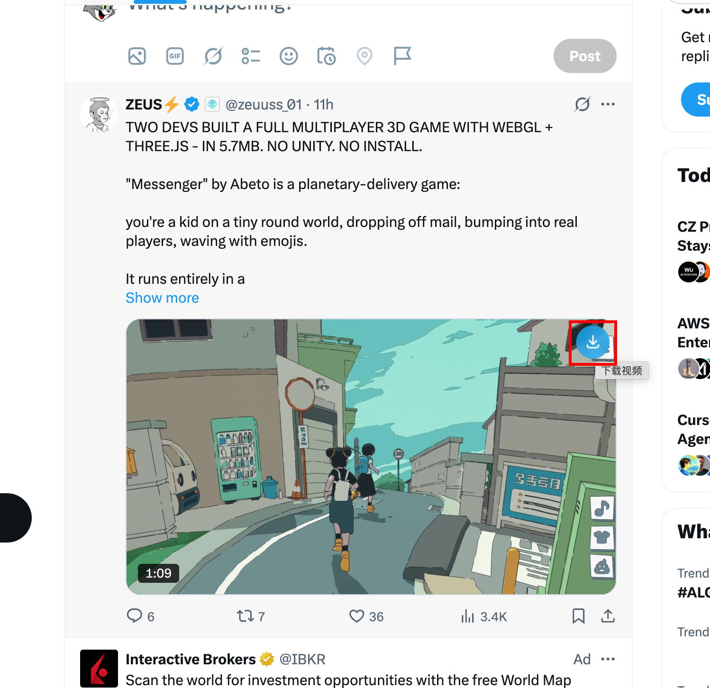

# X Video Downloader

一款 Chrome 扩展，用于一键下载 X（Twitter）上的视频。

## 功能特性

- **悬浮下载按钮** — 在包含视频的推文上自动显示下载按钮，鼠标悬停即可看到
- **多清晰度选择** — 支持多种视频分辨率/码率可选
- **静默下载** — 点击即下，无需跳转页面
- **浮动面板** — 独立浮动窗口管理所有下载任务
- **Shadow DOM 隔离** — 不影响 X 页面原有样式

## 效果预览



鼠标悬停在含视频的推文上时，右上角会出现下载按钮（如上图所示），点击即可开始下载。

## 安装

1. 克隆仓库并安装依赖：

```bash
git clone <repo-url>
cd x-download-video
pnpm install
```

2. 构建生产版本：

```bash
pnpm build
```

3. 打开 Chrome，访问 `chrome://extensions/`，开启「开发者模式」，点击「加载已解压的扩展程序」，选择项目 `dist` 目录。

## 开发

```bash
# 启动开发模式（支持 HMR）
pnpm dev
```

然后在 Chrome 中加载 `dist` 目录作为扩展，打开 [x.com](https://x.com) 即可调试。

## 技术栈

- **Vue 3 + TypeScript** — 前端框架
- **Vite** — 构建工具（含 content script、background、insert script 多入口）
- **Tailwind CSS v4** — 样式方案（通过 PostCSS 插件注入 `!important` 适配 Shadow DOM）
- **Chrome Extension Manifest V3** — 扩展规范

## 项目结构

```
src/
├── background/          # Service Worker 后台脚本
├── contentView/         # Content Script（Shadow DOM 内的 Vue 应用）
│   ├── components/
│   │   ├── FloatingWindow.vue    # 可拖拽/可缩放浮动窗口
│   │   ├── VideoDownloader.vue    # 视频下载主组件
│   │   └── ModelList.vue          # AI 模型列表
│   ├── composables/              # 组合式函数（拖拽、缩放等）
│   └── main.ts                   # 入口：创建 Shadow DOM、注入样式、挂载 Vue
├── insert/             # 注入到页面上下文的脚本（扫描推文、注入按钮）
├── utils/              # 工具函数（API 调用、聊天客户端等）
├── icons/              # SVG 图标组件
└── styles/tailwind.css # Tailwind CSS 入口

public/
├── manifest.json       # 扩展清单文件
└── images/             # 图标资源
```

## 使用说明

1. 安装扩展后，打开任意包含视频的 X 推文
2. 将鼠标移到视频区域，右上角会浮现蓝色下载按钮
3. 点击下载按钮，弹出浮动窗口选择画质和下载方式
4. 支持直链下载（blob）或重定向下载两种模式

## License

MIT
